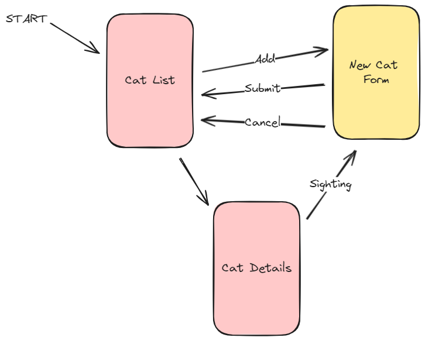

# Development of a Database-Linked Website for NCEA Level 2

Project Name: **PROJECT NAME HERE**

Project Author: **YOUR NAME HERE**

Assessment Standards: **91892** and **91893**

-------------------------------------------------

## Design, Development and Testing Log

### DATE HERE

Replace this test with what you are working on

Replace this text with brief notes describing what you worked on, any decisions you made, any changes to designs, etc. Add screenshots / links to other media to illustrate your notes where necessary.

I showed this to Jeff and got his feedback...

> I think it would be better to have the start at the new cat form. Lorem ipsum dolor sit amet, consectetur adipiscing elit, sed do eiusmod tempor incididunt ut labore et dolore magna aliqua. Placerat duis ultricies lacus sed turpis tincidunt id aliquet risus.

I made some changes and here is V2...

### DATE HERE

Replace this test with what you are working on

Replace this text with brief notes describing what you worked on, any decisions you made, any changes to designs, etc. Add screenshots / links to other media to illustrate your notes where necessary.

### DATE HERE

Replace this test with what you are working on

Replace this text with brief notes describing what you worked on, any decisions you made, any changes to designs, etc. Add screenshots / links to other media to illustrate your notes where necessary.

### DATE HERE

Replace this test with what you are working on

Replace this text with brief notes describing what you worked on, any decisions you made, any changes to designs, etc. Add screenshots / links to other media to illustrate your notes where necessary.

### DATE HERE

Replace this test with what you are working on

Replace this text with brief notes describing what you worked on, any decisions you made, any changes to designs, etc. Add screenshots / links to other media to illustrate your notes where necessary.

### DATE HERE

Replace this test with what you are working on

Replace this text with brief notes describing what you worked on, any decisions you made, any changes to designs, etc. Add screenshots / links to other media to illustrate your notes where necessary.