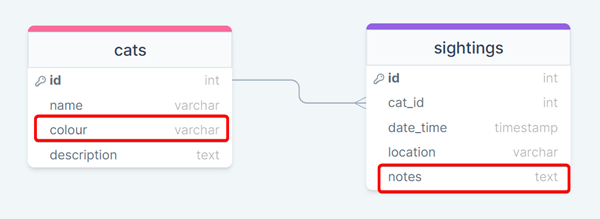
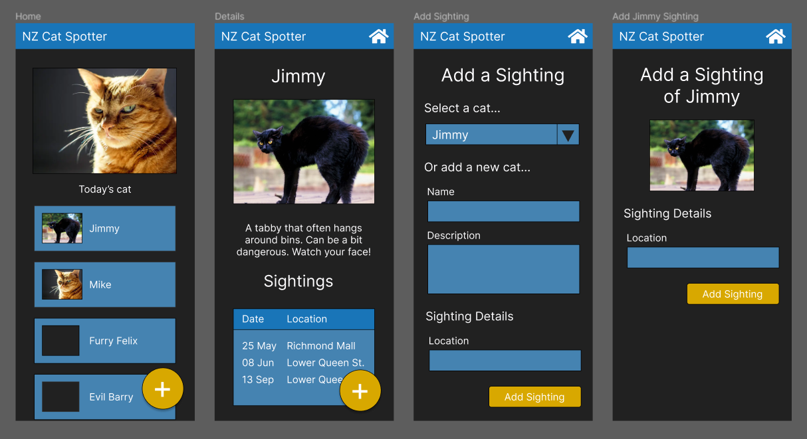
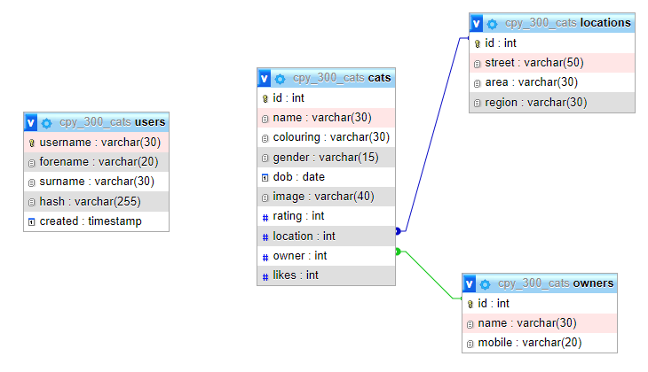
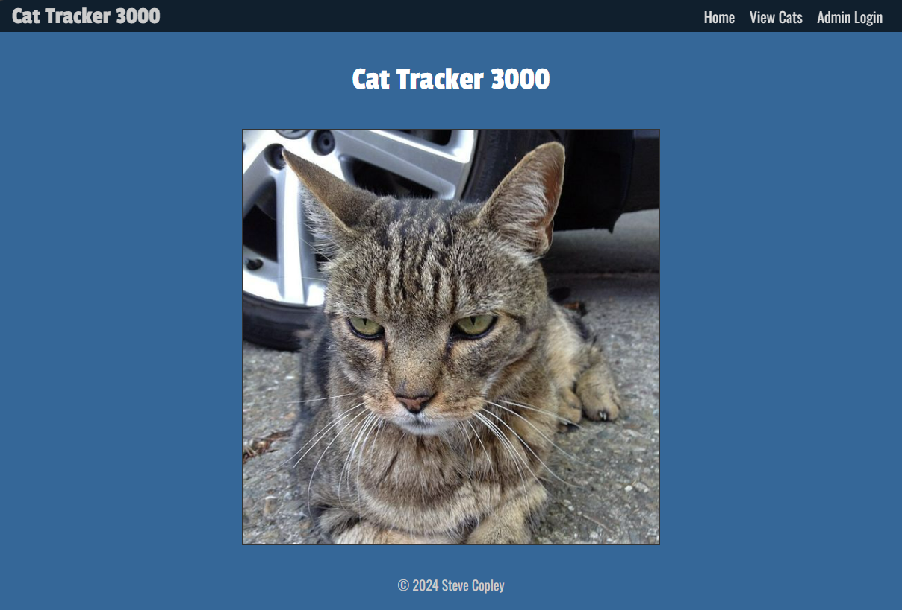
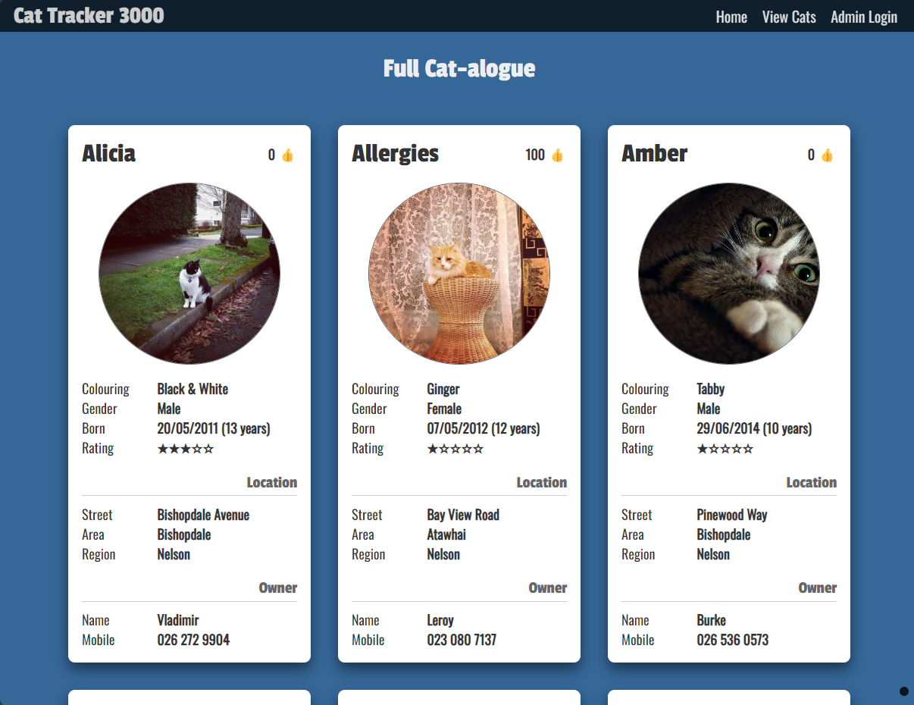

# Design of a Database-Linked Website for NCEA Level 2

Project Name: **CAT SPOTTER**

Project Author: **Steve Copley**

Assessment Standards: **91892** and **91893**

-------------------------------------------------

## System Requirements

### Identified Need or Problem

Cat enthusiasts are always on the lookout for cats. They enjoy spotting them. However it is not easy to keep track of all the cat sightings since they often happen away from home. A system that helped cat spotters track their sightings would be useful.

### End-User Requirements

Cat enthusiasts come from all walks of life, and can be young or old. This means that any system must use clear and simple language, and be suitable for people of any age. It should be accessible in terms of colours and fonts used.

The level of IT expertise of the users could vary from high to very low. This means that the system must be very intuitive to use.

Cat spotters love cats, so the system should be nicely designed, possibly with a cat theme.

### Proposed Solution

A website / app that allows a cat spotter to easily record sightings of new cats, or of known cats. User should be able to:

- View a list of previous cats sighted
- View a list of previous cat sightings (organised by cat, or by date)
- Add a new cat to the system
- Add a sighting of a new cat to the system

Additionally, the system should:

- Be very simple to use
- Be accessible to all
- Be well designed and a pleasure to use

-------------------------------------------------

## Relevant Implications

### Usability

The usability of a system relates to how easy / hard it is to use for the users it is intended for. 

Usability can be measured using Nielsens’s 10 usability heuristics which include:

- Making sure the status of the system is always clear
- Keeping the UI clean and simple
- Having consistency across the UI (similar layout / style)
- Easy recognition of how the UI works (should be intuitive)
- Etc.

I will need to design my system to be as usable as possible since the users of the system may come from all walks of life and will have a wide range of IT skills. I need to ensure that the system is usable for people, even if they aren’t skilled with IT.

As I design my system’s UI, I will refer to Nielsen’s heuristics and try to make sure that the UI meets them as far as possible. 

Specifically, I will aim for a very clean and modern interface (**aesthetic and minimalist design**) that sticks to modern UI conventions (**consistency and standards**). The UI should be very intuitive to use (**recognition rather than recall**). Users should easily be able to see what lessons they are working on (**visibility of system status**).

To verify this, I will test my UI with my users and obtain feedback which will allow me to refine my design.

### Functionality

Lorem ipsum dolor sit amet, consectetur adipiscing elit, sed do eiusmod tempor incididunt ut labore et dolore magna aliqua. Placerat duis ultricies lacus sed turpis tincidunt id aliquet risus.

### End-Users

Lorem ipsum dolor sit amet, consectetur adipiscing elit, sed do eiusmod tempor incididunt ut labore et dolore magna aliqua. Placerat duis ultricies lacus sed turpis tincidunt id aliquet risus. Etiam tempor orci eu lobortis elementum nibh tellus molestie nunc.

-------------------------------------------------

## Final System Design

### Database Structure

This is the final design of my database:

### User Interface Design

This is the final design of my web pages:

-------------------------------------------------

## Completed System

### Database Structure

This is the final database structure that I used:

You can see that it differs from the design in several ways:

- Blah blah blah
- Blah blah

### User Interface Design

This is how my website turned out:

-------------------------------------------------

## Review and Evaluation

### Meeting the Needs of the Users

I initially identified some user needs:
- The system must use clear and simple language
- It should be suitable for people of any age
- It should be accessible in terms of colours and fonts used
- The system must be very intuitive to use
- The system should be nicely designed, possibly with a cat theme

I believe that I have satisfied all of these needs. The system is intuitive to use, and has been refined by user feedback throughout. Language is clear, colours look good, and the site works on both mobile and desktop.

### Meeting the System Requirements

I think that overall, my system meets the needs of my users and of the implications that I initially identified.

### Review of Usability

In my final system, I have produced a design that has a clean and simple UI. The UI was refined from initial concept to the final one using user testing, as well as using the principles of good UX design. The design is consistent throughout the site.

The navigation menu is easy to use and always visible (it ‘sticks’ to the top of the screen), and the status of the system is clear from the clear page headings. The user can always ‘back out’ of any page either using the browser ‘back’ button, or by picking an option from the menu.

### Review of IMPLICATION NAME HERE

Replace this text with brief notes showing how the implication was addressed in the final outcome. Accompany the notes with screenshots / other media to illustrate specific features.

### Review of IMPLICATION NAME HERE

Replace this text with brief notes showing how the implication was addressed in the final outcome. Accompany the notes with screenshots / other media to illustrate specific features.

### Review of IMPLICATION NAME HERE

Replace this text with brief notes showing how the implication was addressed in the final outcome. Accompany the notes with screenshots / other media to illustrate specific features.

