# Development of a Database-Linked Website for NCEA Level 2

Project Name: **CAT SPOTTER**

Project Author: **Steve Copley**

Assessment Standards: **91892** and **91893**

-------------------------------------------------

## Design, Development and Testing Log

### 10 May 2024

I considered a number of possible needs / problems, and after discussing them with my teacher, settled on this one connected with cat spotting, since my family are all avid cat spotters:

**Cat enthusiasts are always on the lookout for cats. They enjoy spotting them. However it is not easy to keep track of all the cat sightings since they often happen away from home. A system that helped cat spotters track their sightings would be useful.**

This problem can be really nicely solved with a website that allows users to record their cat sightings

### 13 May 2024

I sketched out some very rough ideas for how the site might work:

The key functionality that I identified for the system was:
- View a list of previous cats sighted
- View a list of previous cat sightings (organised by cat, or by date)
- Add a new cat to the system
- Add a sighting of a new cat to the system

I think I have a fairly clear idea of what the site should look like and how it should operate. But all of this will need to be confirmed with user testing

I showed my initial sketches to some potential end users and we discussed what the system might look like and do. This was the feedback I obtained from them:

> The system will be great to use. You need to make sure that it works really well on mobile devices since this is what I always carry about when I'm cat spotting. Maybe having a way that photos can be taken and uploaded would be good.

> I like the idea. I would like to be able to sort my cat sightings by cat, location, date, etc. The starting page could have a cat of the day to remind you of cats you may have forgotten about!

### 16 May 2024

Designing the database structure

Worked on a first draft of the DB design:

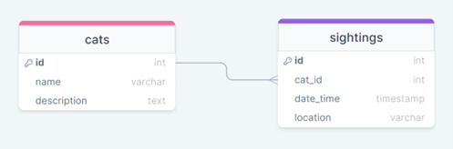

Showed this to my end-user to see if they thought it covered everything. They said:

> It would be good if additional information about the cat was available like cat colour (so we can just see ginger ones for example) and sighting notes

So I updated the DB design to include those things:

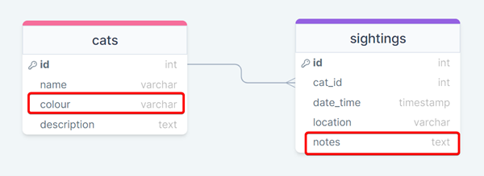

### 23 May 2024

I mocked-up the website pages needed for the key functionality, taking into account the feedback from the initial discussion:

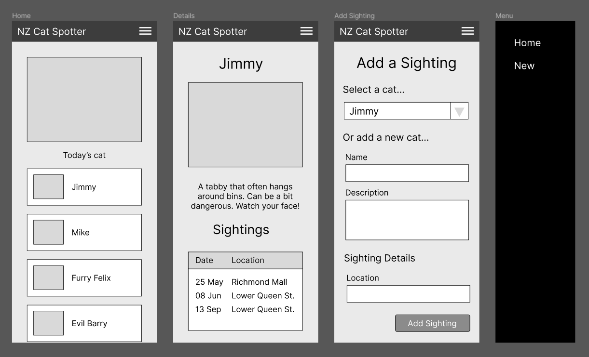

- The home page contains a list of cats
- Clicking a cat goes to the details page with a list of sightings
- The new sighting form is accessible via the top-right menu
The live preview of this design is on Figma [here](https://www.figma.com/proto/jTqPmNyc64hivMN2H7ERja/Cat-Spotter-Mobile-V1?type=design&node-id=1-2&scaling=scale-down&page-id=0%3A1&starting-point-node-id=1%3A2)

I ran the design past some potential end users. We used the Figma preview to get a feel for how the system would work. This was their feedback:

> It's not obvious how to add a new sighting. I had to play around for a while before I found the menu and the New Sighting link

> If I click on a cat, and then try to add a new sighting, whey does the form ask me for the cat's details? Shouldn't it just assume it's a sighting for the cat I was looking at?

### 25 May 2024

Based on the feedback from the end users, I have modified the design of the system:

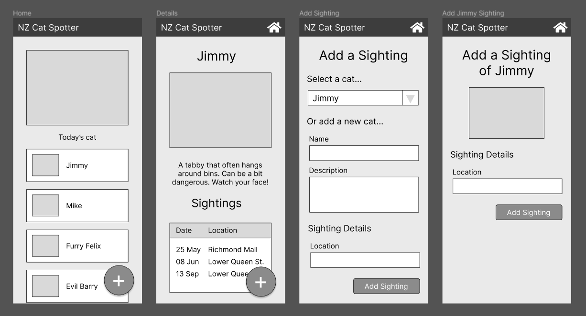

The live preview of this can be found on Figma [here](https://www.figma.com/proto/prOzYN1f9IlWcPN2ttSocY/Cat-Spotter-Mobile-V2?type=design&node-id=1-2&scaling=scale-down&page-id=0%3A1&starting-point-node-id=1%3A2).

These were the key changes I made:
- Removed the menu
- Added '+' buttons
    - on the home page this  goes to a form that asks for the cat details
    - on a details page, the form just gets the sighting details as it knows the cat already

I met once again with my end users. We looked over the improved design. This was their feedback:

> This is much more intuitive. I prefer how this works. It's much easier.

> The big plus button is much more in keeping with other apps I use. The system feels smoother and easier to use. I like it!

### 02 June 2024

I came up with some colour schemes that I thought worked well:
- An [orange-ish one](https://www.realtimecolors.com/?colors=000000-ffffff-eac910-eeeeee-b59830&fonts=Inter-Inter)
- A [green one](https://www.realtimecolors.com/?colors=000000-ffffff-4b9e42-cccccc-295624&fonts=Inter-Inter)

I chose these based on comments from my end users about how they would like the app to have a 'natural' or a 'camo' style, linking in with the hobby of cat-spotting

I sent links of these colour schemes to my end users for their comments and feedback:

> The orange one is pretty nasty! I prefer the green

> The green is the best of the two, but I’d like a darker theme so that the phone is less bright when I’m can spotting at night

### 05 June 2024

Based on the above feedback, I produced this colour scheme, 
I sent it to the end users and they were happy with it.

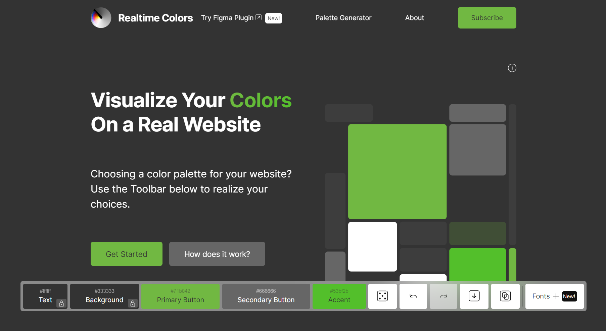

### 10 June 2024

I applied the finalised colour palette to the design on Figma. The live preview of this can be found [here](https://www.figma.com/proto/2Ob9qMW8QH6WSpQJc9oPuA/Cat-Spotter-Mobile-Colour-V1?type=design&node-id=1-2&scaling=scale-down&page-id=0%3A1&starting-point-node-id=1%3A2)

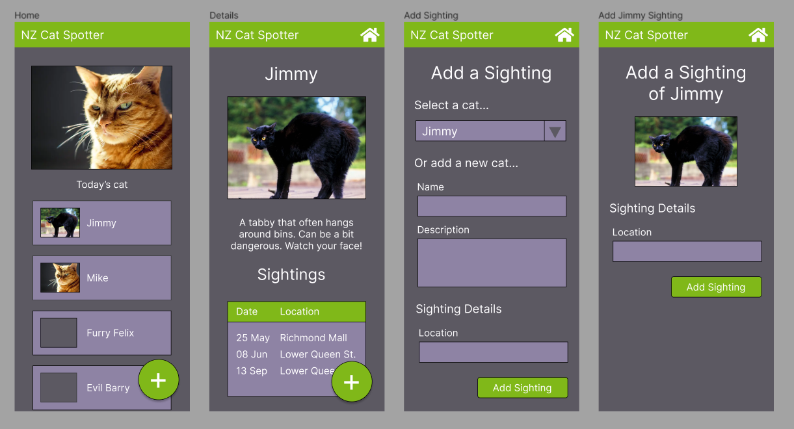

I think the design looks pretty good, and it incorporates all of the feedback from the end users. I will show it to them this week. I have sent them the live link already

The end users had a look at the new coloured design and had this feedback:

> The design needs to be even darker. I’m also not sure about the green any more. Maybe a blue scheme would be better – can you make one?

> It’s ok, but the background should be darker.

>The contrast between the text and the pale grey sections is not very good

I checked the colours in an accessibility checker, and the contrast is a bit too low

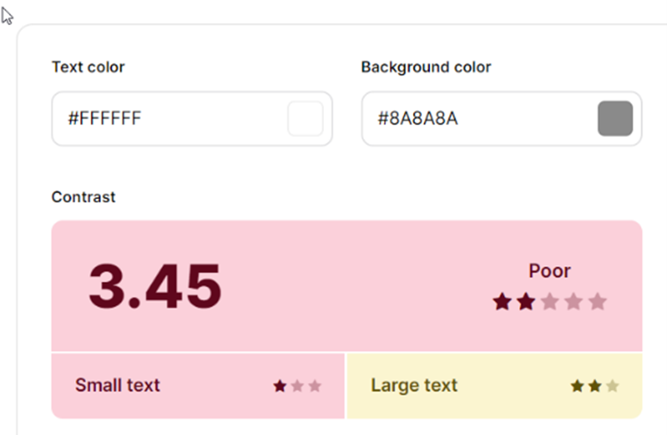

### 15 June 2024

Based on the feedback, I have created this new colour design which I believe works much better, is fully accessible, and takes into account the users’ requests.
The live design is on Figma here.
Key improvements:
- Darker
- Blue is ‘calmer’
- Much better contrast
- Orange highlights key UI elements

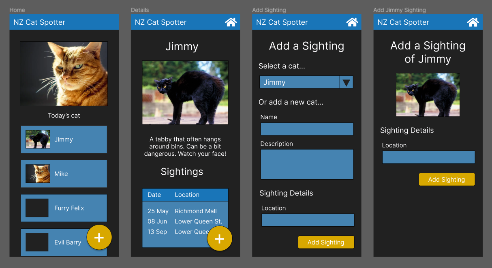

Meeting with the end users, they had this to say about the new design:

> Blah blah blah blah blah blah blah blah blah blah blah blah blah blah blah blah blah blah blah blah blah blah blah blah blah blah blah blah

> Blah blah blah blah blah blah blah blah blah blah blah blah blah blah blah blah blah blah blah blah blah blah blah blah blah blah blah blah blah blah blah blah blah blah blah blah blah blah blah blah blah blah blah blah blah blah blah blah blah blah

### 25 June 2024

I have the site home page setup and working, but without any styling at the moment:

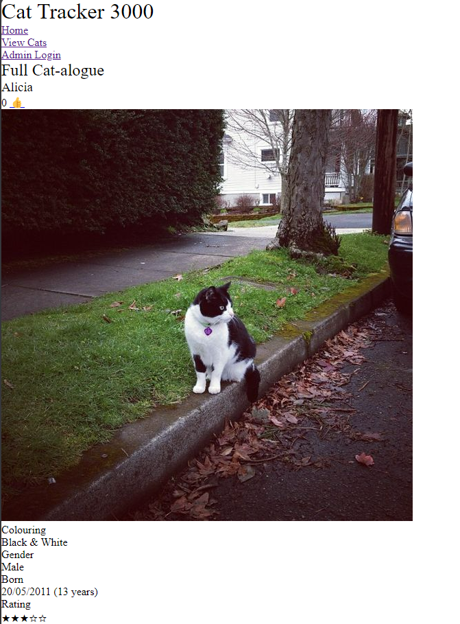

### 28 June 2024

I have now created a stylesheet for the site:

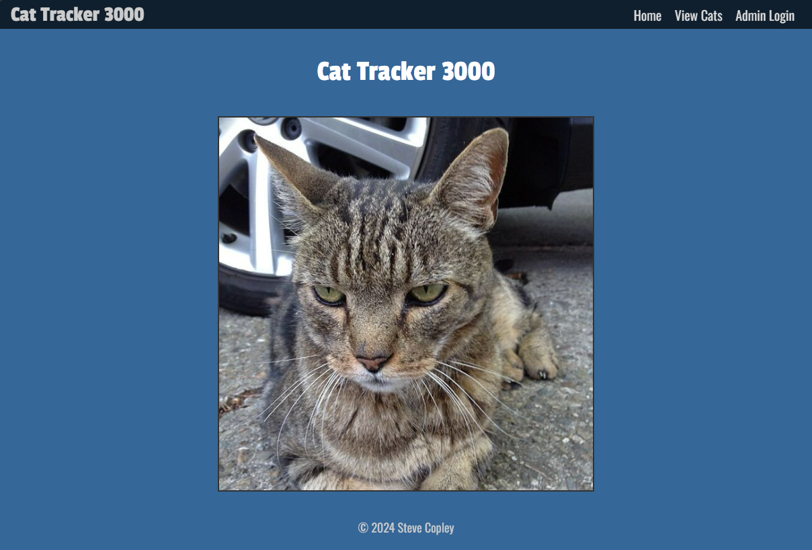

I showed this to my test users for some feedback:

> Looks great. Will there be different cats or any text on the home page? Maybe some instructions?

I will look at adding some instructions on the home page

### 28 June 2024

The site is showing the cat records:

### 06 July 2024

Testing of the add cat functionality.

Here is the cat DB table before adding a sighting:

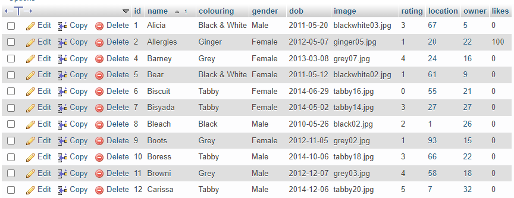

I then add a new cat sighting:

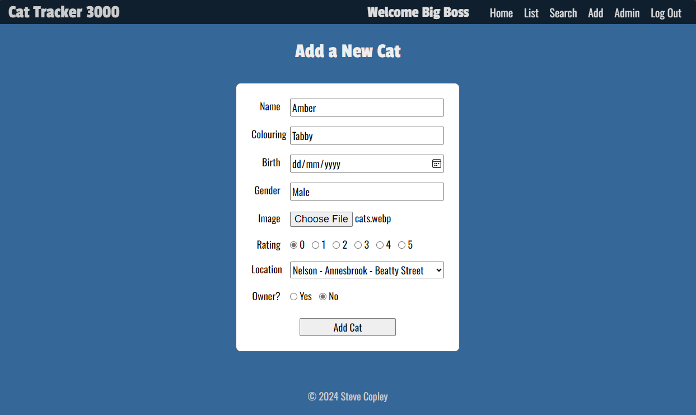

And here is the DB afterwards:

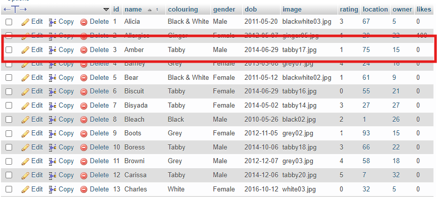

### 10 July 2024

I ran the site pages through the HTML validator service.

Initially my home page had some issues:

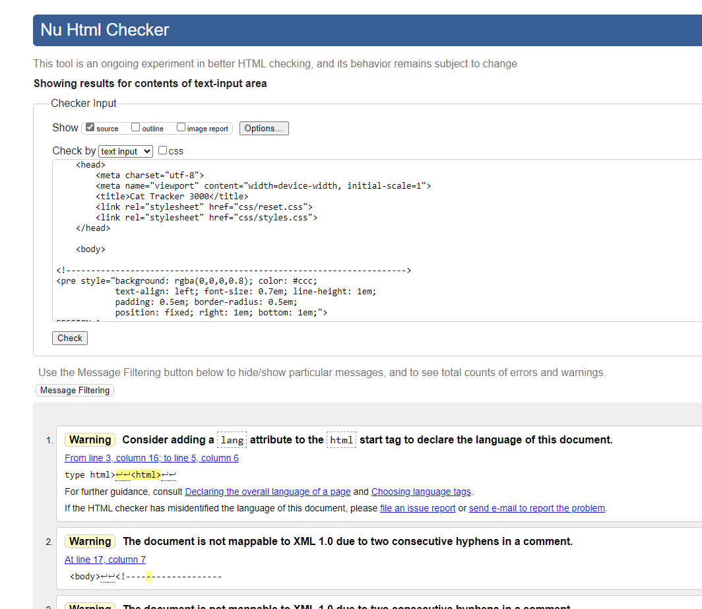

But with some fixes, it passed:

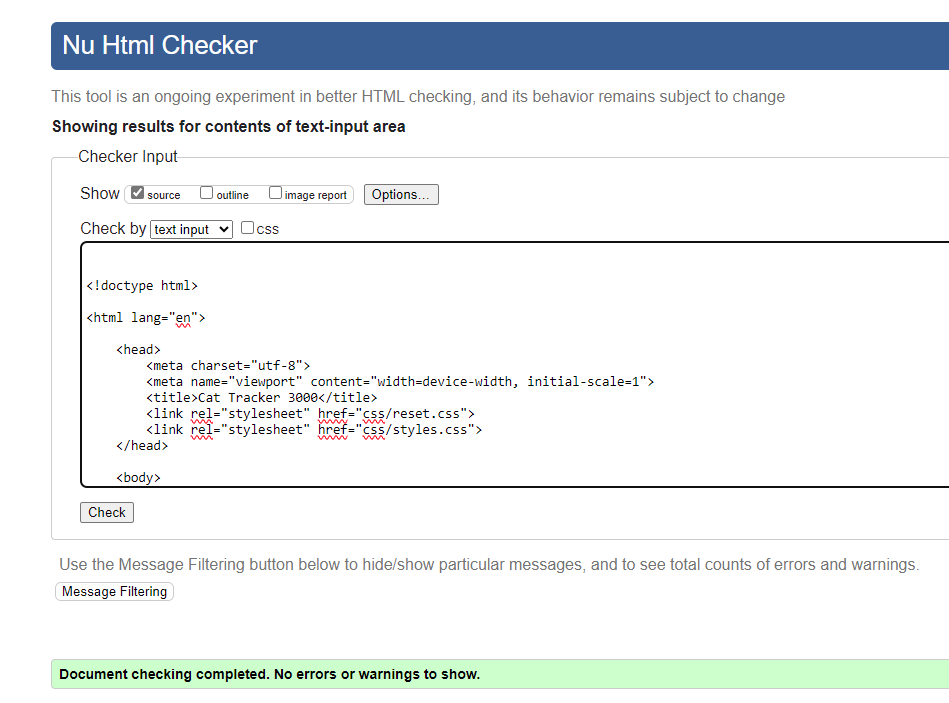

### 15 July 2024

The site now fully works. Here is a video showing all of the features:

[All functionality](https://mywaimeaschool-my.sharepoint.com/:v:/g/personal/steve_copley_waimea_school_nz/EVrnvO3WlEFDhh0edsOj2qUBe2BeibXkK2wNfcY6wMBC5g?nav=eyJyZWZlcnJhbEluZm8iOnsicmVmZXJyYWxBcHAiOiJTdHJlYW1XZWJBcHAiLCJyZWZlcnJhbFZpZXciOiJTaGFyZURpYWxvZy1MaW5rIiwicmVmZXJyYWxBcHBQbGF0Zm9ybSI6IldlYiIsInJlZmVycmFsTW9kZSI6InZpZXcifX0%3D&e=SEZbb1)

I am demonstrating:
- How to login
- How to see all the cats
- How to add a new sighting
- How to search for a cat

